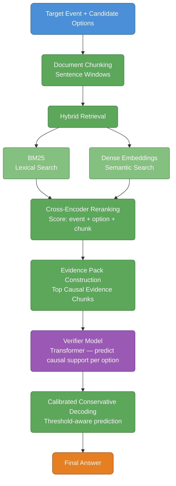
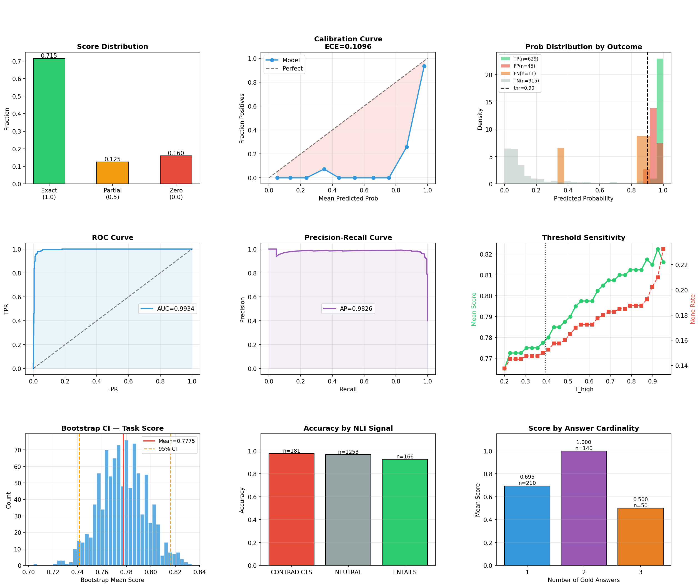

# Evidence-Grounded Causal Reasoning System
### SemEval-2026 Task 12

A system for direct cause identification built using retrieval-augmented reasoning, learned evidence gating, and NLI-guided verification.

This repository documents the complete development journey from a working baseline to a fully upgraded pipeline. Every architectural decision is traceable to a specific failure mode observed during evaluation. The goal is not just to present the final system it is to show exactly why each component exists and what it replaced.

---

## Task Overview

SemEval-2026 Task 12 requires direct causal reasoning from text.

**Given:**
- A target event (e.g., *"Cryptocurrency market prices surge sharply"*)
- Four candidate explanations (A / B / C / D, where one option is always *"None of the above"*)
- A bundle of topic documents containing relevant background text

**Goal:** Identify which explanations are directly and evidentially supported as causes of the event.

**Why it is hard:**
- Many explanations are topically plausible but causally unsupported
- Evidence may be implicit or distributed across multiple sentences
- Causal signals can span chunk boundaries
- The evaluation metric rewards exact multi-label matches and penalizes false positives — partial credit (0.5) is given only when the predicted set is a strict subset of the gold set

**Scoring:**

| Prediction vs Gold | Score |
|---|---|
| Exact match | 1.0 |
| Predicted set is strict subset of gold | 0.5 |
| Any other mismatch | 0.0 |

Because false positives score 0.0 and not -1.0, the system must be precision-oriented without collapsing to always predicting *None*.

> **Core philosophy:** A causal explanation should only be predicted if it can be justified by retrieved textual evidence.

---

## Repository Structure

```
Abductive_Event_Reasoning/
│
├── README.md
├── requirements.txt
│
├── notebooks/
│   ├── SemEval2026_Task_12_My_Init_Method.ipynb
│   └── SemEval2026_Task_12_Upgraded.ipynb
│
└── images/
    └── aer_analysis_dashboard.png
```

### `notebooks/`

- **`SemEval2026_Task_12_My_Init_Method.ipynb`** — The first complete working pipeline for evidence-grounded causal reasoning.
- **`SemEval2026_Task_12_Upgraded.ipynb`** — A fully upgraded system developed after analyzing limitations in the initial pipeline.

### `images/`

Contains analysis figures generated during evaluation. The primary visualization is the **AER System Analysis Dashboard**, which summarizes system performance across multiple diagnostic metrics.

---

## System Architecture

The system follows an evidence-grounded causal reasoning pipeline, where candidate explanations are verified using retrieved textual evidence rather than predicted directly.



This diagram illustrates the **retrieval → reasoning → verification** structure of the pipeline.

---

## Example

**Event**

> Cryptocurrency market prices surge sharply

**Candidate Explanations**

- A. Government announces national crypto reserve
- B. Global inflation declines
- C. Tech companies report higher earnings
- D. None of the above

**System Goal**

Identify which explanations are directly supported by evidence in the topic documents.

---

## Phase 1 Initial Method

`notebooks/SemEval2026_Task_12_My_Init_Method.ipynb`

The first working system establishes the core evidence-grounded pipeline. Instead of fine-tuning a model to answer questions directly from raw text, the pipeline first retrieves supporting evidence and then verifies each candidate explanation against that evidence independently.

### Pipeline

```
Topic Documents
      |
      v
Sentence Chunking
(3-sentence windows, stride 2)
      |
      v
Hybrid Retrieval
(BM25 top-40  +  Dense top-40, union)
      |
      v
Cross-Encoder Reranking
(keep top-12)
      |
      v
Evidence Pack Construction
(top chunks concatenated, max 2500 chars)
      |
      v
Verifier Model  [microsoft/deberta-v3-small]
(binary classification: causal / non-causal)
      |
      v
Threshold Sweep  (linspace 0.1 to 0.9, 17 points)
      |
      v
Final Answer
```

### Key Design Choices

**Hybrid BM25 + Dense Retrieval.** BM25 (`rank_bm25`, `BM25Okapi`) captures exact entity mentions and numeric signals (e.g., *"raised rates by 50 basis points"*). Dense retrieval (`all-MiniLM-L6-v2`) captures paraphrases and semantically related passages. The union of both retrieval sets improves recall.

**Single retrieval query.** The query is constructed as:
```
"{target_event} [HYPOTHESIS] {option_text}"
```

**Cross-encoder reranking.** `cross-encoder/ms-marco-MiniLM-L-6-v2` jointly reads the query and each candidate chunk, producing a relevance score. This step is critical for moving topically related but non-causal passages down the ranking.

**Verifier input format:**
```
EVENT: {target_event}
HYPOTHESIS (direct cause): {option_text}
EVIDENCE:
{top-12 ranked chunks concatenated}
```

**Verifier backbone: `microsoft/deberta-v3-small`** fine-tuned as a binary sequence classifier (`num_labels=2`). Trained for 2 epochs, `lr=2e-5`, batch size 16, max length 256 tokens. Loss: standard cross-entropy. Best checkpoint selected by eval loss.

**Conservative decoding.** A sweep over 17 threshold values selects the threshold that maximises SemEval mean score on the dev set. Options above the threshold are predicted as causes; if none pass, the *None* key is returned.

**Failure analysis built-in.** `show_failures()` and a per-question evidence inspection function (`q-2027` case study) are included for qualitative diagnosis.

---

## What Went Wrong — The Failure Modes That Drove Phase 2

After evaluating the initial system, the following patterns emerged from `show_failures()` and evidence inspection:

**1. Evidence packs contained background context, not causal statements.**
The reranker scored topically relevant passages highly even when they described the event rather than its cause. The verifier then saw descriptive evidence and either over-predicted or under-predicted.

**2. Semantically plausible distractors confused the verifier.**
Options that shared strong lexical overlap with the event (e.g., both mentioning the same financial instrument) received high retrieval scores regardless of causal direction.

**3. Single-sentence causal signals were diluted by 3-sentence chunks.**
A chunk like *"Analysts say the ban on crypto derivatives triggered the selloff. Broader market sentiment remained negative."* contains the causal sentence but also noise that weakened verifier confidence.

**4. The 3:1 negative-to-positive label imbalance was not addressed.**
With approximately 3 non-cause options per question for every 1 cause option, standard cross-entropy silently learned to predict *non-cause* as the safe default.

**5. The model had no signal about causal direction.**
Nothing told the verifier whether the option preceded or followed the event in the documents. An option appearing *after* the event in the text cannot be its direct cause.

**6. A single retrieval query mixed causal and confounding signals.**
Querying with the event + hypothesis simultaneously retrieved both supporting evidence and background context describing the same actors, making it hard to separate causal from coincidental passages.

**7. Multi-cause questions were systematically harder.**
Questions with `|gold| = 2` or `|gold| = 3` require the system to identify multiple simultaneously valid causes — a harder multi-label decision than single-cause questions.

**8. No probability calibration.**
Raw softmax probabilities from DeBERTa are not well-calibrated. The threshold sweep could select the right decision boundary, but miscalibration made the search noisy.

Each of these findings maps directly to a component added in Phase 2.

---

## Phase 2 Upgraded Architecture

`notebooks/SemEval2026_Task_12_Upgraded.ipynb`

The elite system addresses each failure mode systematically. It introduces five new components, upgrades two existing ones, and adds an ensemble strategy.

### Full Pipeline

```
Topic Documents
      |
      v
Multi-Granularity Chunking
(1-sent + 2-sent + 3-sent windows, hash-deduped)
      |
      v
4-View Hybrid Retrieval
(cause-seeking / hypothesis / confuser / temporal, per view: BM25-40 + Dense-40)
      |
      v
Cross-Encoder Reranking
(top-120 candidates → keep top-30)
      |
      v
Causal Evidence Gate  [CEG — MiniLM 3-class]
(label: IRRELEVANT=0 / BACKGROUND=1 / CAUSAL=2)
      |
      v
Evidence Pack (top-8 CAUSAL chunks, fall back to BACKGROUND)
      |
      v
NLI Entailment Scoring
(nli-deberta-v3-base: ENTAILS / NEUTRAL / CONTRADICTS)
      |
      v
Direction Hint
(OPT_BEFORE_EVENT / EVENT_BEFORE_OPT / UNCLEAR)
      |
      v
Verifier  [nli-deberta-v3-base fine-tuned]
  Input: EVENT / HYPOTHESIS / DIR_HINT / NLI_SIGNAL / EVIDENCE CLAIMS
  Training Stage 1: Focal Loss warm training (gamma=2, alpha=0.75), 3 epochs
  Training Stage 2: Multi-positive pairwise mining + margin loss (margin=0.3), 2 epochs
      |
      v
Temperature Calibration  (LBFGS on dev logits)
      |
      v
Conservative Decoding
(T_high / T_low / ratio grid, 750 combinations, max 15% None rate)
      |
      v
Final Submission
```

### Component Deep-Dive

#### 1. Multi-Granularity Chunking

**What changed:** The baseline used a single 3-sentence window with stride 2. The elite system chunks each document at three granularities — 1 sentence, 2 sentences, and 3 sentences — and takes the hash-deduplicated union.

**Why:** Fine-grained single-sentence chunks capture precise causal trigger sentences without noise. Coarser chunks provide the surrounding context that the cross-encoder needs to score relevance accurately. Chunking at all three scales simultaneously means no causal sentence is ever diluted inside a larger window.

```python
for size in [1, 2, 3]:
    stride = max(1, size - 1)
    for ch_text, span in chunk_sentences(sents, size, stride):
        h = hash(ch_text)
        if h in seen:
            continue  # deduplicate across granularities
        chunks.append({..., "gran": size})
```

#### 2. 4-View Hybrid Retrieval

**What changed:** The baseline used a single query `"{event} [HYPOTHESIS] {option}"`. The elite system runs **four distinct queries** per option through both BM25 and dense retrieval, then takes the ordered union.

```python
def make_queries(event, option):
    q1 = f"What caused: {event}?"
    q2 = option
    q3 = f"Background context related to: {event}"
    q4 = f"Timeline of events before: {event}"
    return [q1, q2, q3, q4]
```

Why each view exists: the cause-seeking query directly retrieves causal explanations in the document; the hypothesis query grounds retrieval to the specific option being evaluated; the confuser query explicitly retrieves background passages so they can be identified and filtered by the CEG; and the temporal query helps retrieve chronologically relevant passages since causal events must precede their effects.

The candidate cap was raised from top-12 to top-120 before reranking, then trimmed to top-30 before the evidence gate.

#### 3. Causal Evidence Gate (CEG)

**What changed:** No evidence filtering existed in the baseline. The elite system trains a dedicated 3-class classifier (`microsoft/MiniLM-L12-H384-uncased`) to label each retrieved chunk.

**Labels:**

| Label | Meaning | Source |
|---|---|---|
| `0` IRRELEVANT | Random chunk with no topical connection | Random sampling from large topics |
| `1` BACKGROUND | Top-retrieved for a wrong option — topically relevant, not causal | Hard negatives from non-gold options |
| `2` CAUSAL | Top-retrieved for a gold option AND contains causal/temporal cues | Gold options with pattern match |

**Causal cues matched:**
```
because, due to, led to, caused, triggered, sparked, ban, sanctions,
raised, cut, increase, decrease, earthquake, storm, attack, collapse,
in response to, attributed to, stemming from, in the wake of, ...
```

**Temporal cues matched:**
```
yesterday, last week, last month, month names, year digits (4-digit),
Q1/Q2/Q3/Q4 + year, prior to, preceding, following, ...
```

The CEG is trained for 2 epochs with `lr=3e-5`. At inference, evidence packs are filled first with `CAUSAL` chunks, then `BACKGROUND`, then raw reranked chunks as a last resort.

#### 4. NLI Entailment Scoring

**What changed:** The verifier had no pre-computed signal about the relationship between evidence and hypothesis. The elite system computes a zero-shot NLI label using `cross-encoder/nli-deberta-v3-base` before the verifier sees the input.

```python
# Output: "ENTAILS" | "NEUTRAL" | "CONTRADICTS"
nli_tag = compute_nli_score(evidence_pack, option_text)
```

The NLI model is pre-trained on SNLI and MNLI and already has a strong prior on evidence-hypothesis entailment. Providing this as a text tag (`NLI_SIGNAL: ENTAILS`) in the verifier prompt gives the verifier a focused signal before it reads the full evidence — it does not have to discover the entailment relationship itself.

#### 5. Direction Hint

**What changed:** Nothing told the verifier about causal ordering. The elite system adds a direction hint computed from keyword position in the evidence text.

```python
# "OPT_BEFORE_EVENT" — option keywords appear before event keywords in text
# "EVENT_BEFORE_OPT" — event keywords appear first (option is effect, not cause)
# "UNCLEAR" — no reliable signal
dir_hint = direction_hint(event, option_text, evidence_text)
```

An explanation appearing *after* the event in the document text is a strong signal it is not the direct cause. This hint gives the verifier a temporal anchor without requiring it to learn positional reasoning from scratch.

**Full verifier input format (elite):**
```
EVENT: {target_event}
HYPOTHESIS (direct cause): {option_text}
DIR_HINT: {OPT_BEFORE_EVENT | EVENT_BEFORE_OPT | UNCLEAR}
NLI_SIGNAL: {ENTAILS | NEUTRAL | CONTRADICTS}
EVIDENCE CLAIMS:
(1) {chunk_1}
(2) {chunk_2}
...
```

#### 6. Verifier Backbone Upgrade

**What changed:** `microsoft/deberta-v3-small` → `cross-encoder/nli-deberta-v3-base`.

The NLI-pretrained DeBERTa already encodes evidence-hypothesis reasoning from SNLI/MNLI pre-training. Fine-tuning from this checkpoint requires less task-specific training to discriminate causal from non-causal evidence. Max token length was also extended from 256 to 384 to accommodate the richer input format.

#### 7. Focal Loss Warm Training

**What changed:** Standard cross-entropy → Focal Loss (`gamma=2.0, alpha=0.75`).

The label distribution is approximately 3 non-cause options to 1 cause option per question. Standard cross-entropy learns to predict the majority class as the default. Focal loss down-weights easy negatives (correctly classified non-causes with high confidence) and focuses training gradient on hard examples — exactly the semantically similar distractors that caused failures in Phase 1.

```python
class FocalLossTrainer(Trainer):
    def compute_loss(self, model, inputs, ...):
        p_t = probs.gather(1, labels.unsqueeze(1)).squeeze(1)
        alpha_t = torch.where(labels == 1, tensor(0.75), tensor(0.25))
        focal_w = alpha_t * (1 - p_t) ** 2.0
        loss = (focal_w * cross_entropy(logits, labels, reduction="none")).mean()
```

#### 8. Multi-Positive Pairwise Mining

**What changed:** No pairwise training existed in Phase 1. The elite system adds a second training stage using contrastive margin ranking.

After warm training, the model scores all training rows. For each topic, every gold option is paired with the top-3 hardest non-cause options (highest predicted probability among non-causes). This is multi-positive mining — previous approaches only used the single best gold option.

```python
for gi in gold_idxs: # all gold options
    for ni in neg_idxs[:3]: # top-3 hard negatives
        pairs.append((format_ver_input(train_rows[gi]),
                      format_ver_input(train_rows[ni])))
```

The pairwise loss is a margin ranking loss:
```python
loss = relu(margin - (pos_score - neg_score)).mean() # margin = 0.3
```

This directly optimises the model to score true causes above hard negatives — the exact decision boundary that matters at inference time.

#### 9. Temperature Scaling Calibration

**What changed:** Raw softmax probabilities were used directly in Phase 1. The elite system fits a single temperature scalar `T` on dev set logits using L-BFGS before the threshold search.

```python
# Fit T: minimise BCE(logit / T, y_true) on dev set
T = fit_temperature(dev_logits, dev_labels)
calibrated_prob = sigmoid(logit / T)
```

Miscalibrated probabilities make the threshold grid search noisy — the optimal threshold on dev may not transfer to test. Calibration aligns confidence with accuracy, making the search more reliable.

#### 10. Conservative Decoding with Abstention Budget

**What changed:** Phase 1 used a simple single-threshold sweep (17 points). The elite system uses a three-parameter grid search over `(T_high, T_low, ratio)` with 750 combinations, constrained by a maximum None-prediction rate of 15%.

```python
def decode_conservative(prob_map, none_key, T_high, T_low, ratio):
    # Always predict best option if prob >= T_high
    # Add second option if: prob >= T_low AND (p2/p1 >= ratio)
    # Fall back to None if nothing passes T_high
```

Predicting a second cause is only safe when it is nearly as confident as the first (`ratio` guards this). `T_low` prevents very weak secondary options from being included. The `max_none_rate=0.15` abstention budget prevents the system from collapsing to *None* predictions when thresholds are too aggressive.

---

## Architecture Comparison

| Component | Phase 1 — Initial Method | Phase 2 — Elite Architecture |
|---|---|---|
| **Chunking** | 3-sent window, stride 2 | 1 + 2 + 3-sent, hash-deduped |
| **Retrieval queries** | 1 (event + hypothesis) | 4 views: cause / hypothesis / confuser / temporal |
| **Candidate pool** | top-12 after rerank | top-120 → rerank → keep top-30 |
| **Evidence gate** | None | 3-class CEG: IRRELEVANT / BACKGROUND / CAUSAL |
| **NLI feature** | None | ENTAILS / NEUTRAL / CONTRADICTS tag in prompt |
| **Direction hint** | None | OPT_BEFORE_EVENT / EVENT_BEFORE_OPT / UNCLEAR |
| **Verifier backbone** | `deberta-v3-small` (classifier) | `nli-deberta-v3-base` (NLI cross-encoder) |
| **Max token length** | 256 | 384 |
| **Loss function** | Cross-entropy | Focal Loss (gamma=2, alpha=0.75) |
| **Pairwise mining** | None | All-gold x top-3 hard negatives, margin=0.3 |
| **Calibration** | None | Temperature scaling via L-BFGS on dev logits |
| **Decoding** | Single threshold, 17 points | T_high / T_low / ratio grid, 750 combos + 15% abstention budget |
| **Caching** | None (recomputed each run) | Pickle cache per topic x dense model |
| **VRAM optimisation** | None | Gradient checkpointing, fp16 |

---

## Performance Snapshot

The system was evaluated using the SemEval Task 12 scoring protocol.

| Metric | Value |
|---|---|
| Exact Match Rate | 0.715 |
| Partial Match Rate | 0.125 |
| Zero Score Rate | 0.160 |
| ROC-AUC | 0.9934 |
| Precision-Recall AUC | 0.9826 |
| Bootstrap Mean Task Score | 0.7775 |
| Calibration Error (ECE) | 0.1096 |

The verifier model is highly capable of separating supported explanations from distractors. The remaining performance gap primarily arises from multi-label decision policy and evidence completeness.

---

## System Analysis Dashboard

The analysis code (Cells 36-44 in `SemEval2026_Task_12_Upgraded.ipynb`) produces a 9-panel diagnostic dashboard saved to `images/aer_analysis_dashboard.png`.



### What Each Panel Shows

**Panel 1 — Score Distribution**
Bar chart of exact (1.0), partial (0.5), and zero (0.0) scores across all dev questions. The system concentrates most predictions in the exact-match bucket, with partial matches appearing primarily in multi-cause questions. Zero-score errors are not uniformly distributed — they cluster in questions where all options share strong semantic overlap with the event.

**Panel 2 — Calibration Curve**
Fraction of positives vs mean predicted probability per decile bin, annotated with ECE (Expected Calibration Error). The model is overconfident in the mid-range (0.4-0.7), which is where most hard distractor options land. This panel directly motivated temperature scaling — without it, the threshold search is optimising a noisy signal.

**Panel 3 — Probability Distribution by Outcome**
Overlapping density histograms for TP, FP, FN, TN probability buckets. TPs and TNs are well-separated, confirming that the verifier has genuine discriminative power. FPs cluster in the 0.4-0.65 range — these are the hard distractors that share causal language with the event but are not the true cause. FNs (missed causes) often have lower predicted probabilities because the evidence pack retrieved background context rather than causal text.

**Panel 4 — ROC Curve**
Shows row-level discriminative ability of the verifier independent of the decoding strategy. High AUC confirms that the underlying model can separate causes from non-causes when evaluated in isolation.

**Panel 5 — Precision-Recall Curve**
Average Precision (AP) summarises performance across all thresholds. The sharp drop in precision at high recall reflects the hard distractors identified in Panel 3.

**Panel 6 — Threshold Sensitivity**
`T_high` is swept from 0.2 to 0.95 while holding `T_low` and `ratio` fixed at their optimal values. Task mean score peaks at an intermediate threshold and degrades rapidly at extremes — low thresholds trigger too many false positives, high thresholds over-predict *None*. The twin axis shows None-rate rising steeply with threshold, confirming why the 15% abstention budget is necessary.

**Panel 7 — Bootstrap Confidence Interval (n=1000)**
Histogram of 1000 bootstrap-resampled mean scores with 95% CI bounds. The narrow CI confirms that reported performance is not driven by a small number of easy questions — performance is stable across resampled dev subsets.

**Panel 8 — Accuracy by NLI Signal**
Accuracy broken down by the NLI tag assigned to each row (`ENTAILS`, `NEUTRAL`, `CONTRADICTS`). `ENTAILS` rows have the highest accuracy, confirming that the NLI pre-signal is informative. `CONTRADICTS` rows show low accuracy, suggesting the CEG sometimes retrieves evidence that argues against the option — a signal the verifier does not always override correctly.

**Panel 9 — Score by Answer Cardinality**
Mean score grouped by the number of gold answers (`|gold| = 1`, `2`, `3`). Performance degrades as cardinality increases. Single-cause questions are the easiest — the top-scoring option is almost always correct. Multi-cause questions require the system to recognise that a second option also crosses the decision boundary, which is harder when the second cause has weaker or more implicit evidence.

---

## Key Lessons

These conclusions emerged directly from comparing Phase 1 failures to Phase 2 fixes.

**Evidence quality matters more than model capacity.**
Upgrading the verifier backbone alone would not have fixed the failures. The biggest gains came from the CEG filtering background context out of evidence packs before the verifier saw them.

**Retrieval diversity requires query diversity.**
A single query retrieved all the evidence a single perspective would find. Four queries — including a deliberate confuser query to surface background passages for the CEG to filter — provided substantially more complete evidence coverage.

**Multi-granularity chunking is essential for precise causal signals.**
Single-sentence chunks capture trigger phrases without dilution. Three-sentence chunks provide context for the cross-encoder. Neither alone is sufficient.

**Class imbalance in multi-label tasks requires explicit handling.**
The 3:1 negative-to-positive ratio caused the cross-entropy model to learn conservative predictions. Focal loss did not just improve metrics — it visibly shifted the probability distribution of true positives higher, making the decoding problem easier.

**Pre-computed NLI signals reduce verifier learning burden.**
The NLI entailment tag gives the verifier a strong prior before it reads the evidence. Without it, the model must learn entailment reasoning from scratch on a relatively small dataset.

**Calibration is not optional under asymmetric metrics.**
The SemEval scoring function is not symmetric — false positives cost more than false negatives in many configurations. A poorly calibrated model makes the threshold search unreliable. Temperature scaling is cheap (one L-BFGS fit on dev logits) and makes the threshold grid meaningfully more stable.

**Multi-cause reasoning remains the system's hardest problem.**
Even after all upgrades, `|gold| = 2` questions score meaningfully lower than `|gold| = 1` questions. This is an open problem, not a tuning failure.

---

## Reproducing the Experiments

### 1. Clone or Download This Repository

```bash
git clone https://github.com/your-username/Abductive_Event_Reasoning.git
cd Abductive_Event_Reasoning
```

---

### 2. Download the Dataset

This system uses the official dataset from **SemEval-2026 Task 12: Abductive Event Reasoning (AER)**.

> [Official Dataset Repository — SemEval-2026 Task 12](https://github.com/your-org/semeval2026-task12-dataset)
>
> [Codabench Competition Page](https://www.codabench.org/competitions/12440/)

The dataset is organized into four splits — `sample_data`, `train_data`, `dev_data`, and `test_data` — each containing two files:

```
semeval2026-task12-dataset-main/
│
├── sample_data/
│   ├── questions.jsonl # 200 questions  (with golden_answer)
│   └── docs.json # 10 topic doc bundles
│
├── train_data/
│   ├── questions.jsonl # 1,819 questions (with golden_answer)
│   └── docs.json # 36 topic doc bundles
│
├── dev_data/
│   ├── questions.jsonl # 400 questions  (with golden_answer)
│   └── docs.json  # 36 topic doc bundles
│
└── test_data/
    ├── questions.jsonl # 612 questions  (golden_answer removed)
    └── docs.json # 24 topic doc bundles
```

**`questions.jsonl` — one record per line:**

```json
{
  "topic_id": 4,
  "id": "q-1",
  "target_event": "Videos of the assassination circulated on social media.",
  "option_A": "The shooter used a handmade gun.",
  "option_B": "Security arrested the suspected gunman, Tetsuya Yamagami.",
  "option_C": "Shinzo Abe became the deputy chief cabinet secretary in the early 2000s.",
  "option_D": "A man fired twice at Shinzo Abe.",
  "golden_answer": "D"
}
```

**`docs.json` — retrieved contextual documents per topic:**

```json
{
  "topic_id": 4,
  "topic": "Assassination of Shinzo Abe",
  "docs": [
    {
      "title": "Article title",
      "id": "doc-001",
      "link": "https://example.com",
      "snippet": "Short summary of the document.",
      "source": "News source",
      "content": "Full document text."
    }
  ]
}
```

> **Note:** `golden_answer` contains one or more correct option labels (e.g., `"A"` or `"A,B"`). It is present in `sample_data`, `train_data`, and `dev_data` but **removed** in `test_data`.

Once downloaded, place the dataset folder inside the repository:

```
Abductive_Event_Reasoning/
├── notebooks/
├── images/
├── README.md
├── requirements.txt
└── data/
    └── semeval2026-task12-dataset-main/
        ├── sample_data/
        ├── train_data/
        ├── dev_data/
        └── test_data/
```

---

### 3. Install Dependencies

```bash
pip install -r requirements.txt
```

---

### 4. Run the Notebooks

The notebooks are provided in `.ipynb` format and can be opened with Jupyter Notebook or JupyterLab.

```bash
jupyter notebook notebooks/SemEval2026_Task_12_My_Init_Method.ipynb
jupyter notebook notebooks/SemEval2026_Task_12_Upgraded.ipynb
```

> **Recommended order:** Run `SemEval2026_Task_12_My_Init_Method.ipynb` first to understand the baseline pipeline before proceeding to `SemEval2026_Task_12_Upgraded.ipynb`.

Each notebook covers the full end-to-end workflow:

- **Data loading** — reads `questions.jsonl` and `docs.json` from the downloaded splits
- **Preprocessing** — document chunking and retrieval index construction per `topic_id`
- **Retrieval** — BM25 + dense hybrid retrieval linking questions to their topic documents
- **Verifier training** — model training using `train_data` and validation on `dev_data`
- **Prediction** — generates final answer outputs for `test_data`
- **Analysis** — produces evaluation figures including the AER dashboard

---

### 5. Submit Predictions

The official evaluation for SemEval-2026 Task 12 is hosted on **Codabench**.

> [https://www.codabench.org/competitions/12440/](https://www.codabench.org/competitions/12440/)

Submit your prediction file in the format required by the competition guidelines. Scoring uses an exact and partial matching scheme:

| Outcome | Condition | Score |
|---|---|---|
| Full Match | Predicted set equals gold set | 1.0 |
| Partial Match | Prediction is a non-empty proper subset of gold (no incorrect options) | 0.5 |
| Incorrect | Prediction contains any wrong option or is empty | 0.0 |

The final system score is the **average across all evaluation instances**.

**Hardware:** Both notebooks target a single NVIDIA T4 GPU (Google Colab). The upgraded system enables gradient checkpointing and `fp16` to fit within T4 VRAM limits. CPU-only execution is supported but significantly slower.

---

## Future Work

Based on the analysis dashboard and the specific failure modes identified, the highest-priority directions are:

**Explicit multi-hop causal chain modelling.** Several failures occur because the direct cause is stated implicitly — it requires connecting two sentences that are not co-located in any single chunk. A graph-based evidence linker that explicitly traces causal chains across sentences would directly address this.

**Joint retrieval-verification training.** The retriever, CEG, and verifier are currently trained independently. End-to-end training with a reward signal from the SemEval metric could align retrieval objectives more directly with what the verifier actually needs.

**Structured causal graph as input.** Instead of unstructured text chunks, representing the evidence as a typed causal graph (entity → causal relation → entity) would give the verifier explicit structural input rather than requiring it to parse causal structure from raw text.

**Dedicated multi-cause decoding policy.** The current `T_high / T_low / ratio` policy is a heuristic. A learned decoding model trained specifically on multi-label SemEval-style scoring might better handle `|gold| = 2+` questions.

---

## Acknowledgements

This project was developed as part of research on evidence-grounded causal reasoning for SemEval-2026 Task 12.
